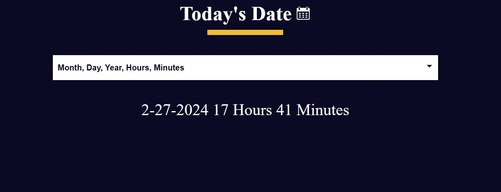

# Date Formatter Project

This is a simple web-based date formatting tool created using **HTML**, **CSS**, and **JavaScript**. The tool allows users to select a date from a dropdown menu of date formats to display the date accordingly.

The project is designed to be easily customizable. You can add more date formats by modifying the switch case in the script file. The tool is a great way to practice working with front-end technologies and can be expanded into a more comprehensive date utility with additional features and formats.

## Technologies Used:

- HTML
- CSS
- JavaScript

## Getting Started:

To use this project, simply clone the repository and open the `index.html` file in your web browser. From there, you can select a format from the dropdown menu to see the formatted date.

